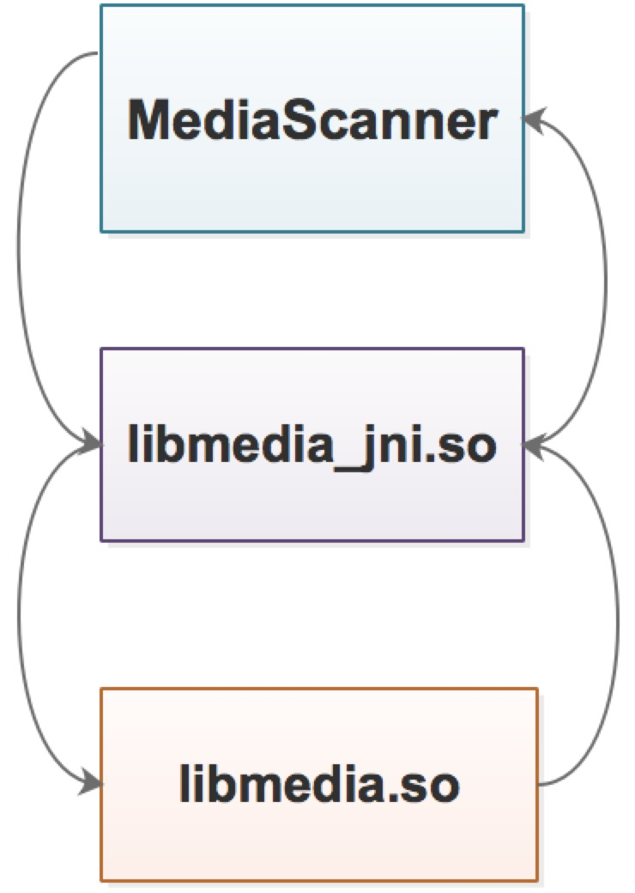

# JNI 学习

## JNI 概述
JNI 是 Java Native Interface 的缩写，该技术可以做到：

- Java 程序中的函数可以调用 native 语言编写的函数
- Native 程序中的函数可以调用 Java 层的函数

JNI 出现的原因：

- Java 虚拟机用 native 语言编写，虚拟机又运行在具体的平台上，所以虚拟机本身无法做到平台无关，
JNI 可以对 Java 层屏蔽不同系统平台之间的差异。
- 调用先有的 Native 功能

## MediaScanner 实例

- java 类 MediaScanner 
- JNI 层对应 libmedia.so，media_jni 是 JNI 库的名字，其中，下划线前的 "media" 是 Native 层
库的名字，这里就是 libmedia 库。Android 平台基本上都采用 "lib_模块名_jni.so" 的命名方式。
- Native 层对应的是 libmedia.so 这个库完成实际的功能

---

__代码__

<code> 
    public class MediaScanner { 
        static {
          /* 加载对应的 JNI 库，media_jni 是 JNI 库的名字，实际加载动态的时候会将其
          扩展成 libmedia_jni.so, Windows 扩展为 media_jni.dll */
          System.loadLibrary("media_jni");
          // 调用 native_init 函数
          native_init();
        }
        // 声明一个 native 函数，native 为 java 的关键字，标识它将由 JNI 层完成
        private static native final void native_init();
        // 
    }
</code>

[JNIenv Api](https://blog.csdn.net/junjieking/article/details/8088972)

  