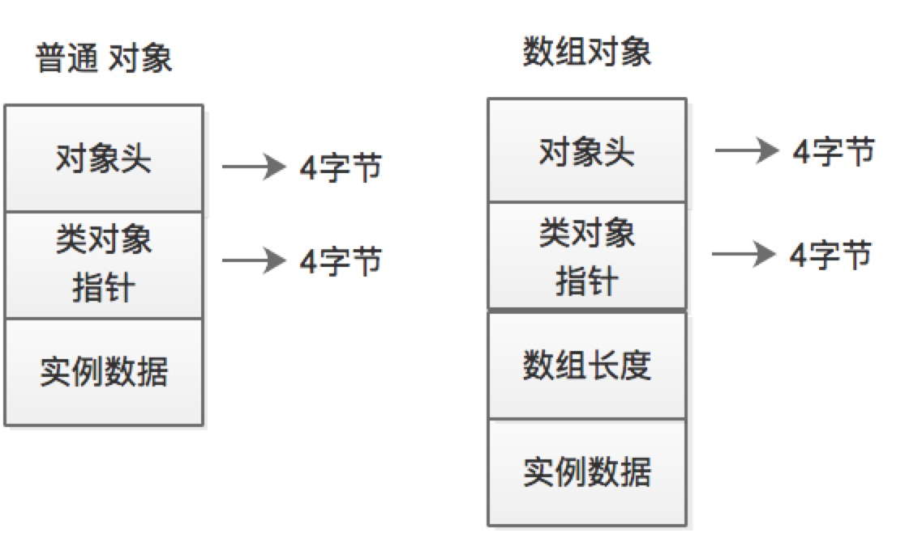

# 计算 Java 对象大小
 - link: https://blog.csdn.net/wuwenxiang91322/article/details/80216420
 - 计算大小类：ObjectSizeCalculator
 
**普通对象结构** 按 64 位机器的长度计算
  1. 对象头 (_mark), 8 个字节
  2. OOP指针，如果是 32G 内存以下的，默认开启对象指针压缩，4 个字节
  3. 数据区
  4. Padding (内存对齐)，安装 8 的倍数对齐 
  
**数组对象结构**
  1. 对象头 (_mark), 8 个字节
  2. OOP指针，如果是 32G 内存以下的，默认开启对象指针压缩，4 个字节
  3. 数组长度，4 个字节
  4. 数据区
  5. Padding (内存对齐)，安装 8 的倍数对齐 
  

计算大小的方法：
  1. 通过java.lang.instrument.Instrumentation的getObjectSize(obj)直接获取对象的大小，只计算引用的长度，不计算所有引用的对象实际大小。
  
  2. 通过sun.misc.Unsafe对象的objectFieldOffset(field)等方法结合反射来计算对象的大小。
     
     (1). 通过反射获得一个类的 Field
     (2). 通过 Unsafe 的 objectFieldOffset() 获得每个 Field 的 offSet
     (3). 对 Field 按照 offset 排序，取得最大的 offset，然后加上这个 Field 的铲毒，再计算 Padding 对齐
  
  3. 使用 jdk.nashorn.internal.ir.debug.ObjectSizeCalculator.getObjectSize(Object obj)
  
  
     - 对象头 (Mark Word)：用于存储对象自身的运行时数据，如哈希码(hashcode)、GC 分代年龄、锁状态标志、线程持有的锁、偏向线程 ID、偏向时间戳
     - Class 对象指针：Class 对象指针的大小也是 4个字节，其指向的位置是对象对应的 Class 对象的内存地址
     - 对象实际数据：这里面包括了对象的所有成员变量，其大小由各个成员变量的大小决定，
     - 对齐：最后一部分是对齐填充的字节，按 8 个字节填充
  
  
  
  
  
  
  
  
  
  
  
  
  
  
  
  
  
  
  
  
  
  
  
  
  
  
  
  
  
  
  
  