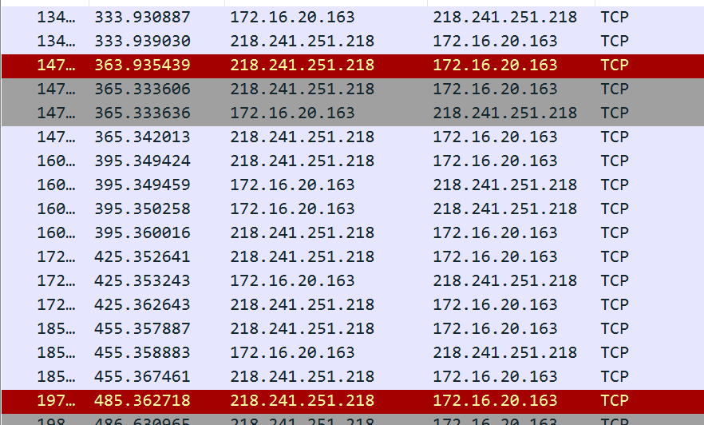

# 服务端日志出现大量 Connection reset by peer
现象描述：终端设备连接 SaaS 平台的 Netty 服务，该连接为长连接。每隔一段时间服务端就会出现 Connection Rest。

问题分析：
    1. 服务端重置终端连接，服务端发送数据导致 connection rest。
    2. 客户端重置终端连接，服务端发送数据，channel 被 close 导致 connection reset
    3. 网路配置导致连接超时，客户端或服务端 connection reset
排查过程：
    1. TCP 连接信息：sudo netstat -nat|awk '{print $6}'|sort|uniq -c|sort -rn (哪个用户创建的进程，哪个用户可以查看，
    root 用户可以查看全部)
      
       这个没有看出任何问题，只是 TIME_WAIT 信息比较多，需要具体查看；这里关注 netty 端口的链接信息，没有出现异常
    2. 查看网络信息：netstat -s, 关注 TCP 的 丢包率，重发包，REST 信息。
    
       估算每秒的丢包信息，分析丢包信息，可能是网络配置引起，
    3. TCP 抓包：选择具体 IP抓包，确定具体是哪一个端出现 REST
    
    4. 再分析发 REST 的端，具体问题    
    5. 再具体分析 REST 时间间隔, 查看网路链接超时问题
    
    
    
    6. IT 确认配置问题：配置了禁止游戏策略 
 总结： 
   - 网路指标
   - TCP 基础知识
   
    
    