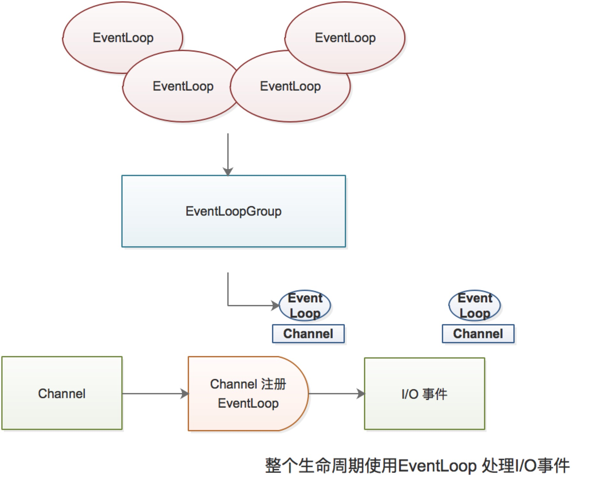

# Channel EventLoop ChannelFuture
   - Channel -> socket
   - EventLoop -> 控制流 多线程 并发
   - ChannelFuture -> 异步通知

## Channel 接口
  基本的 I/O 操作 (bind、connect、read、write) 依赖于底层网络传输所提供的原语

## EventLoop 接口
  EventLoop 定义了 Netty 的核心抽象，用于处理链接的生命周期中所发生的事件，
  
  EventLoopGroup EventLoop Thread Channel 关系
  - 一个 EventLoopGroup 包含一个或者多个 EventLoop
  - 一个 EventLoop 在它的生命周期内只和一个 Thread 绑定
  - 所有由 EventLoop 处理的 I/O 事件都将在它专用的 Thread 上被处理
  - 一个 Channel 在它的生命周期内只注册与一个 EventLoop
  - 一个 EventLoop 可能会被分配一个或多个 Channel
  
## 跨集群的消息分发
 ### 联合交换器和联合队列
 联合交换器允许发往上游节点交换器的消息被透明的发送至下游节点中相同名称的交换器上，联合队列允许下游节点扮演上游节点
 中共享队列的消费者角色，为多个下游节点提供轮询消费消息的能力。联合队列用于解决消息通信负载特别有用。某些队列可能会
 有大量的消息发布活动，而消息消费速度相对慢，或者受到限流的影响。 
 RabbitMQ 可以通过联合服务器减少网络分区的不一致性。
 
  