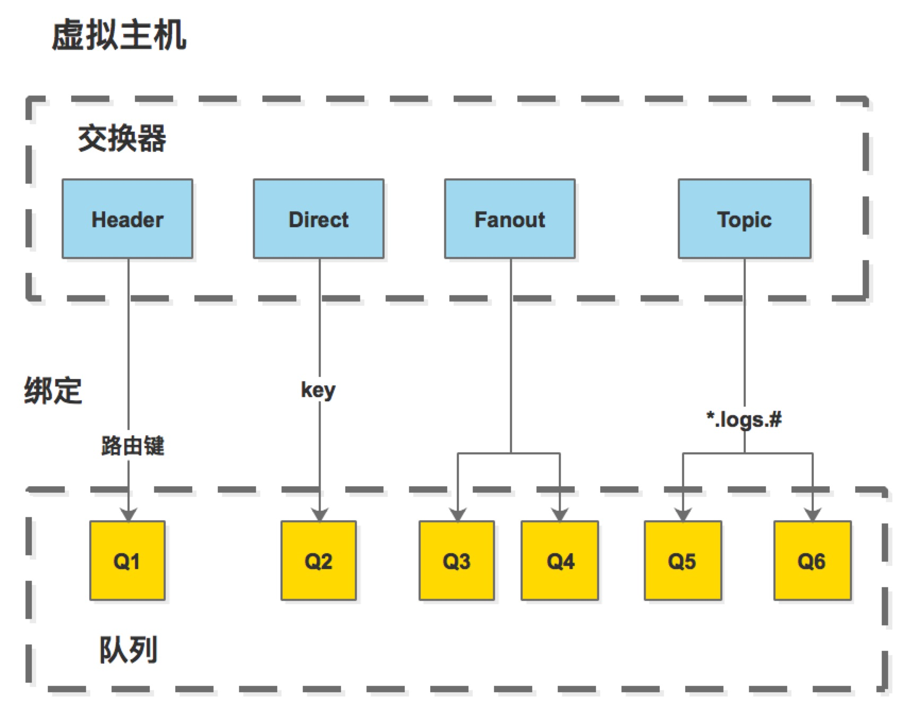
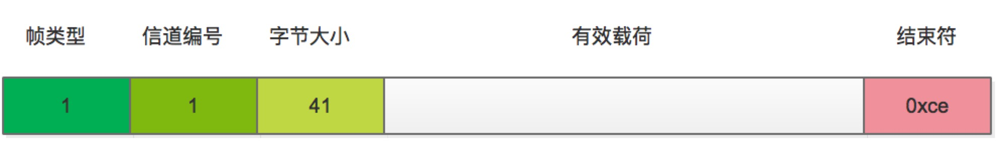
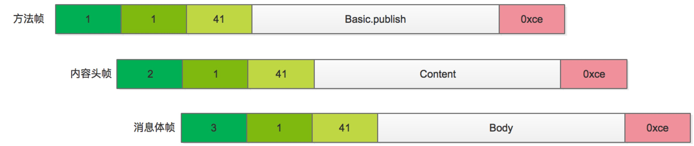
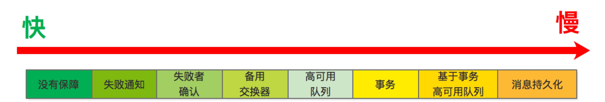
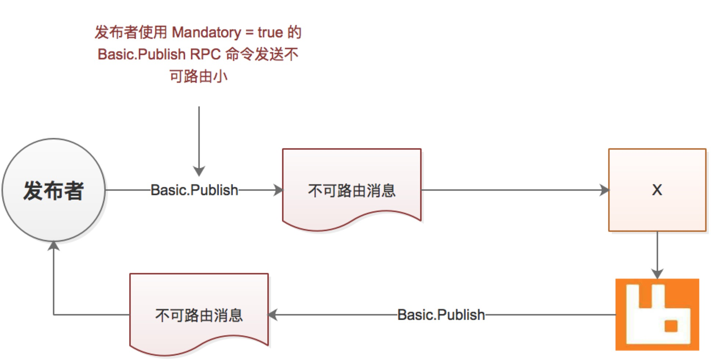

# RabbitMq 高效部署分布式队列

## 消息通信

### 信道
   生产者和消费者通过 TCP 链接 Rabbitmq，当TCP 链接打开，应用程序就可以创建一条 TCP 链接内的
具有唯一标识 ID 虚拟链接 AMQP 信道，这样命令就可以在 AMQP 的信道中传播。 
   我们知道 TCP 是传输数据报协议，具有传输数据的能力，为什么不直接通过 TCP 直接传输 AMQP 数据？ 
   主要原因：TCP 的建立和销毁开销非常大，系统 TCP 链接数量有限。

### 虚拟主机 交换器 队列 路由器 绑定
   AMQP 消息必须包含三部分：交换器、队列、绑定。生产者把消息发送到交换器上，路由器通过绑定的键，把消息
发送到对应的队列上.  

   消费者消费消息可以通过 basic.consume 和 basic.get，basic.consum 自动拉取消息实现高吞吐量，
basic.get 获取单条信息。mq 投递消息到队列，如果没有消费者订阅消息，消息将在队列中保存，如果有多个消费
者订阅，Rabbitmq 将以轮询的方式发送消息。Rabbitmq 对于发送的消息必须接收到消费者的消息确认后，进行
删除，否则 Rabbitmq 将在一段时间后认为消息未投递，进行再次发送。  
   direct exhange: 关注 payload(消息内容)、交换器、路由器   
   topic exchange: 关注 路由键，'.' 把路由键分为几部分，'*' 匹配特定位置的任意文本，'#' 匹配所有规则  
   多租户：*vhost*  
   多租户特点: 数据隔离、安全、可移植性强。在 Rabbitmq 集群中创建 vhost 会同步整个集群
  
### 持久化
   队列的 durable 设置为 true. 要持久化一个消费需要保证：投递模式设置为 2、发送到持久化队列、到达持久化队列。
如果在持久化消息时服务器宕机了，消息丢失，却无法进行确认，需要 AMQP 的事务支持，事务十分影响性能。所以Rabbitmq
采用信道 confirm 模式确认消息投递，当信道设置成 confirm 模式，发布的每一条消息都会获得唯一的 ID 

## 管理
   RabbitMq 的日志目录：/var/log/rabbitmq  
   Rabbitmq 的配置文件目录: /etc/rabbitmq.confg, 节点启动可以通过 rabbitmq-server 脚本对 CONFIG_FILE 设置，
配置文件是一个包含嵌套哈希表的数组。 
   <code> \[  
             { mnesia, \[{dump_log_write_threshold, 100}] }  
             { rabbit, \[{vm_memory_high_watermark, 0.4}]}    
  </code>  
  - mnesia 是 Mnesia 数据库配置用了存储 exchange 和 queue 元数据, dump_log_write_threshold:
  把 Mnesia 条目从仅限追加的文件刷出到真实数据文件的频度。Mensia 通过将 RabbitMq 元数据首先写入一个仅限追加的日志
  文件，以确保完整性，然后在定期将日志内容转储到真实的 Mnsia 数据库文件。 
  - rabbit 是 rabbit 的配置
  
## 权限控制
   权限控制组成：被授予权限的用户、权限控制 vhost、需要授予的读/写/配置权限的组合、权限范围。
   eg: sbin/rabbitmqctl set_permissions -p hostName userName ".*"(配置)  ".*"(写)  ".*"(读)
       sbin/rabbitmqctl clear_permission -p hostName userName
   
## 统计数据
   [命令](command.md)
   
## 日志

   ### 日志文件   
   *rabbitmq 日志信息可以通过 AMQP exchange queue binging 获取*  
   日志路径：配置 LOG_BASE 环境变量， 默认值在 rabbitmq-server 脚本 LOG_BASE=/var/log/rabbitmq
   在该文件夹下会创建两个文件： 
      RABBITMQ_NODENAME-sasl.log: 系统应用程序支持库  
      RABBITMQ_NODENAME.log:  
   RABBITMQ_NODENAME 指 \_rabbit@localhost_ 或者 rabbit  
   
   ### 轮换日志
    sbin/rabbitmqctl rotate_logs suffix
   
   ### 通过 AMQP 实时访问日志
   RabbitMq 利用 amq.rabbitmq.log topic exchange 把日志发布到交换器上，并以严重级别作为路由键：error、warning、info
    
## 集群
   - RabbitMq 集群搭建使用 HAProxy。需要考虑持久化节点和内存节点保存、创建元数据方式和故障后，
     主节点队列数据丢失，备份节点创建元数据的影响，
   - Warren + HAProxy 搭建数据共享主备集群
   - Shovel 搭建 数据中心数据复制
## WEB 和 API 支持
   插件: rabbitmq-manager plugin rabbitmq GUI
   脚本: rabbitmq-admin 脚本  
 
## RabbitMQ 松耦合优势
   - 解耦应用：可以解耦应用和数据库的交互
   - 解耦数据库写入
   - 无缝添加新功能：对同一份数据的重复利用
   - 复制数据与事件：Rabbit 间复制
   - 多主（Multi-Master）互联化数据与事件
   
## AMQP 通信过程
  AMQP 帧的组成：帧类型、信道编号、以字节为单位的帧大小、帧的有效载荷、结束字节符(0xce)
  AMQP 帧的类型：协议头帧方法帧、内容头帧、消息体帧、心跳帧 
  AMQP 将消息编组成帧，发送的第一个帧是携带命令和执行它所需参数的方法帧。方法帧之后是内容帧，包含
  内容和消息体，内容头帧包含消息属性以及消息体大小。AMQP的帧大小有一个上限，如果消息体超过这个上限，
  消息内容将被拆分多个消息体帧。
   
  - 消息体结构
  
  - 有效载荷  
  方法帧: Basic | Publish | 交换器名称 | 路由键值 | Mandatory  
  内容头帧: 消息体大小 | 标志值 | 内容类型 | app_id | timestamp | 投递模式  
  消息体帧:  
  Mandatory 标志 RabbitMq 必须投递成功，否则发布消息的过程就应该是失败的 Basic.Return  
  
  ### 协议
  - 声明交换器：Exchange.declare Exchange.declareOK 
  - 声明队列：Queue.Declare Queue.DeclareOK 
  - 绑定队列到交换器：Queue.bind Queue.bindOK
  - 发布消息：C: Basic.Publish 内容头 消息体
  - 消费消息：C: Basic.Consume S: Basic.ConsumeOK Basic.Deliver 消息头 消息体 C: Basic.ACK
    
  ### 属性 Basic.Properties
  消息属性嵌入在消息头帧中，包含描述消息的信息：
  - content-type: 让消费者知道如何解释消息体
  - expiration: 消息过期时间
  - reply-to: 响应消息的路由
  - content-coding: 指示消息体使用某种特殊的方式进行压缩和编码
  - delivery-mode: 消息写入硬盘还是内存
  - headers: 自由格式的属性和实现 RabbitMq 路由
  - message-id/correlation-id: 唯一标识消息和响应信息，用于在流程中进行跟踪
  - app-id/user-id: 消息发布者者应用程序
  - priority
  - timestamp: 减少消息大小，并创建一个规范定义来描述消息创建时间
  - type: 定义发布者和消费者的契约

## 消息发布性能
  
  在 RabbitMQ中，在创建可靠投递的每个机制都会对性能产生一定的影响，创建应用体系结构时，需要牢记金发姑娘原则。
  以下的问题可以帮助找到刚刚好的解决方案： 
     - 消费发布时保证消息进入队列的重要性有多高？
     - 如果消息无法路由，是否应将消息返回给发布者？
     - 如果消息无法路由，是否应该其发送到其他地方稍后进行重新路由
     - 如果 RabbitMQ 服务器崩溃，可以接受消息丢失？
     - RabbbitMQ 在处理新消息时是否应该确认它已经为发布者执行了所有请求的路由和将任务持久化
     - 消息是否可以批量投递，然后从 RabbitMQ 从收到一个确认用于表明所有请求的路由和持久化任务已经批量应用
     到所有消息中
     - 如果你要批量发布消息，这些消息需要确认路由和持久化，那么对每一条消息是否需要对目标队列实现真正意义上的
     原子提交
     - 在可靠投递是否有可接受的平衡性，发布者可以使用它来实现更高的性能和消息吞吐量
     - 消息发布还有哪些方面会影响消息吞吐量和性能
  在非核心链路中，正常的消息发布不必处理每个可能的故障点，找到合适的平衡点获得可靠和可预测的运行时间。
  
  
## 可靠消息投递
 - 使用 Mandatory 标识投递消息，它只会让 RabbitMQ 向你投递失败，而不会通知成功，如果消息路由正确，你的发布者将
 不会收到通知。
 
 - 在发布任何消息之前，消息发布者向 RabbitMQ 发出 Confirm.Select RPC 请求，并等待 Confirm.SelectOK 响应以
 获知投递确认已经被启动。在这点上，对于发布者发送给 RabbitMQ 的每条消息，服务器会发送一个响应确认消息(Basic.Ack)
 或否定确认(Basic.Nack)
 - 基于事务的批处理：AMQP 事务，事务机制提供了一种方法，通过这种方法可以通知发布者消息被成功投递到 RabbitMQ 代理
 服务器上的队列。启动一个事务，发布者发送一个 TX.SelectRPC 请求给 RabbitMQ，RabbitMQ 将回复一个 TX.SelectOK响应。
 一旦事务被打开，发布者可以向 RabbitMQ 发送一个或多个消息，发布者向 RabbitMQ 发送 TX.CommitOK 提交事务，否则回滚事务
 TX.Rollback. 该事务只针对单个队列进行操作，多个队列就不能保证原子性。
 - HA 队列，是 RabbitMQ 的一种增强功能，不包含在 AMQP 中，它允许队列在多个服务器上拥有冗余副本。声明队列时加入参数
 arguments={'x-ha-policy': 'all'}. 当发布消息到设置为高可用的队列时，该消息会被发送到集群中的每台服务器，该集群
 管理者 HA 队列，一旦消息在集群中的任何节点都完成消费，那么消息所有副本将立即从其他节点删除。 
 HA 队列也可以跨越集群节点，设置 arguments={'x-ha-policy':'nodes', 'x-ha-nodes':{'node1','node2'}}。在HA队列
 中有一个主服务器节点，其他所有节点都是辅助节点，如果主节点发生故障，其中一个辅助节点将接管主节点的角色。当一个宕机的节点
 被添加回来或者一个新的节点被添加到集群时，它被不包含任何已经存在于现有节点队列中的消息。
 - 消息持久化：消息持久化投递的队列必须持久化队列，对性能的影响很大，如果 RabbitMQ 由于操作系统发生 I/O 阻塞而无法响应
 发布者或者消费者时，那么消息就不能被发布或投递。
 - RabbitMQ 回推，如果发布者应用程序因为发布消息太快而开始对 RabbitMQ 造成压力，那么 RabbitMQ 将发送 Channel.Flow 
 阻塞发布者。Channel.Flow 不推荐使用，Channel.Flow 只是一种警告，推荐使用 TCP 背压。 
 背压：在内部，RabbitMQ 使用信用的概念来管理回推发布者的时机，在建立新的链接时，链接将被分配一个预定数量的可用信用值，
 然后当 RabbitMQ 接收每个 RPC 命令时，将扣除一个信用点，一旦 RPC 请求在内部完成处理，链接就会返回被扣除的信用值，链接
 的信用余额由 RabbitMQ 评估，以确定它是否应该从链接的套接字读取数据，如果一个链接的信用值不足，它将逃过直到他有足够的信用值。
 Connection.Blocked 阻塞发布者，Connection.UnBlock 取消阻塞。Connection.Blocked Connection.Unblock 都是异步操作的。
  
 
 ### 备用交换器
  - 备用交换器是 RabbitMQ 团队创建的 AMQ 模型的一个扩展，用于处理无法路由的消息。备用交换器在第一次声明交换器时
  被指定，用来提供一种预先存在的交换器。声明备用交换器：Exchange.declare 声明 alternate-exchange  
  - 死信队列，由于接收不可路由的消息，路由模式：# 
 ### 消费消息性能
  - 设置消费消息 no_ack, 可以提高 RabbitMQ 的吞吐量，但是应用程序所面临的风险取决于消息大小和数量以及操作系统中套接字接收
  缓冲区的大小。 
    如果 no_ack 不适合当前的应用程序体系架构，但又希望获取逐个消息投递和确认更快的消息吞吐量，可以考虑控制服务质量的预取设置
  - 通过服务质量(Quality Of Service Qos)设置，即在确认消息接收之前，消费者可以预先要求接收一定数量的消息。QoS 设置允许 RabbitMQ
  通过消费者预先分配一定梳理的消息来实现更高效的消息发送。 
  虽然 AMQP 规范要求 Basic.Qos 方法同时设置预期总量和预取大小，但是如果设置了 no_ack=true，预取大小将被忽略
 ### 队列保留参数
  - x-dead-letter-exchange: 用于路由那些不重新发送且被拒绝的消息
  - x-dead-letter-routing-key: 用于死信消息的可选路由键
  - x-expires: 队列在指定的毫秒数被删除
  - x-ha-policy: 创建 HA 队列时，指定跨节点实现的 HA 模式
  - x-ha-nodes: HA 队列分布的节点
  - x-max-length: 队列的最大消息数
  - x-message-ttl: 以毫秒为单位的消息过期时间，队列级别执行
  - x-max-priority: 启用最大优先级为 255 的队列排序功能
  
 ### 集群
  - RabbitMQ 集群是按照 低延时 设计的，千万不要跨越 WAN 或者 互联网搭建
  - 集群的大小，维护集群的共享状态的工作和开销与集群中节点的数量的多少成正比
  - RabbitMQ 向集群中添加一个节点，就为集群中的状态同步增加了更多的复杂性，集群中的每个节点必须知道
  其他节点， 
  
   
   

   
   
   

   
   
   
   
   
   
   
   
   
   
   
   
   
   
   
   
   
   
   
   
   
   
   