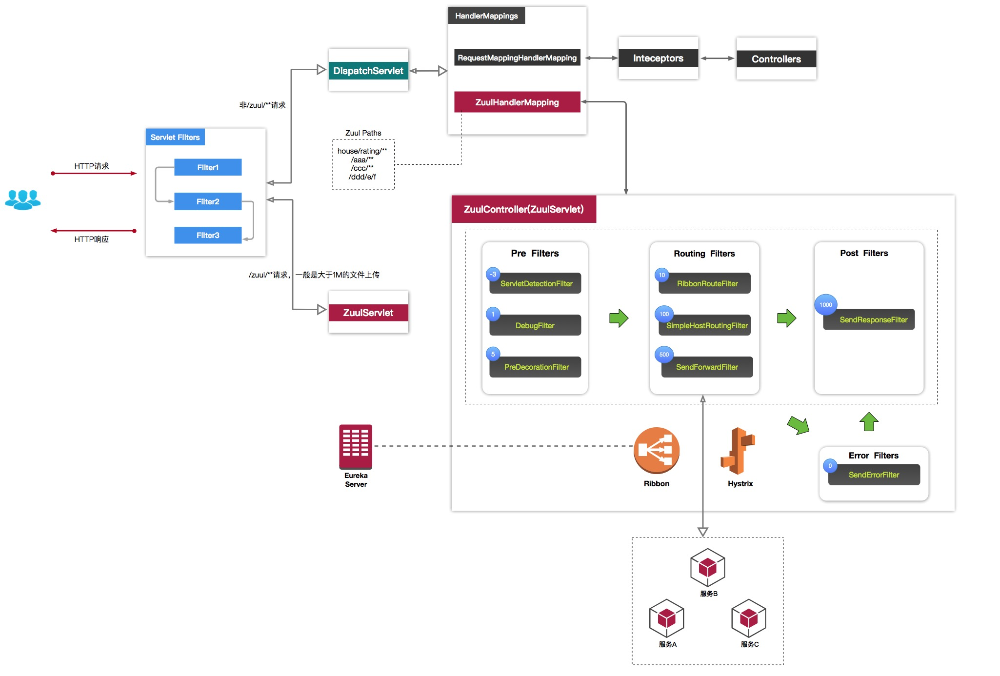

# 网关基础
  物理解释：网关(Gateway)又称网间连接器、协议转换器。网关在网络层以上实现网络互连，是最复杂的网络互连设备，仅用于两个
高层协议的网络互连。 
  用途：网关对收到的信息要重新打包，以适应系统的需求。 
  在 OSI 中，网关有两种：一种是面向连接的网关，一种是无连接的网关。当两个子网之间有一定距离时，往往将一个网关分成两半，
中间用一条链路连接起来，称为半网关。 

## 协议
- GGP：核心网关为了正确和高效地路由报文需要知道 Internet 其他部分发生的情况，包括路由信息和子网特性。
  
  当一个网关处理重负载而使速度特别慢，并且这个网关是访问子网的唯一途径，通常使用这种类型的信息，网络中的其他网关能裁剪交通
流量以减轻网关的负载。核心网关之间通过发送 GGP 信息，并等待应该来通信，之后如果收到含特定信息的应答就更新路由表。

- EGP：外部网关协议用于在非核心的相邻网关之间传输信息，非核心网关包含互联网上所有与其直接相邻的网关路由信息及其所连机器信息
但是它不包含 Internet 上其他网关信息。

- IGP：内部网关协议，最流行的是 RIP 和 HELLO，另一个协议称为开发式最短路径优先协议(OSPF)

## 类型
- 传输网关：用于在 2 个网络间建立传输链接，利用传输网关，不同网络上的主机间可以建立起跨越多个网络的、级联的、点对点的传输链接。
- 应用网关：应用网关在应用层上进行协议转换。

## 微服务网关
好处： 
  1. 减少客户端复杂性，减少客户端与服务之间的交互
  2. 易于认证处理，可在微服务网关上进行认证，然后再将请求转发到后端的微服务
  3. 易于监控
  
## Zuul
  Zuul 是 Netflix 开源的微服务网关，它可以和 Eureka、Ribbon、Hystrix 等组件配合使用。Zuul的核心是一系列过滤器。 
     1. 身份认证与安全：识别每个资源的验证要求，并拒绝那些与要求不符的请求  
     2. 审查与监控：在边缘位置追踪有意义的数据和统计结果  
     3. 动态路由：动态的将请求路由到不同的后端集群  
     4. 压力测试：逐渐增加指向集群的流量，以了解性能  
     5. 负载分配：为每一种负载类型分配对应容量，并弃用超出限定值的请求  
     6. 静态响应处理：在边缘位置直接建立响应部分，从而避免其转发的内部集群  
     7. 多区域弹性：跨越 AWS Region 进行请求路由，旨在实现 ELB 使用多样化  
  Spring Cloud 对 Zuul 进行整合与增强。目前，Zuul 使用的默认 Http 客户端是 Apache Http Client，也可以使用 RestClient 
  ribbon.restClient.enable = true 或者 okhttp3.OkHttpClient ribbon.okhttp.enable = true 
  
  
### 配置信息

    

