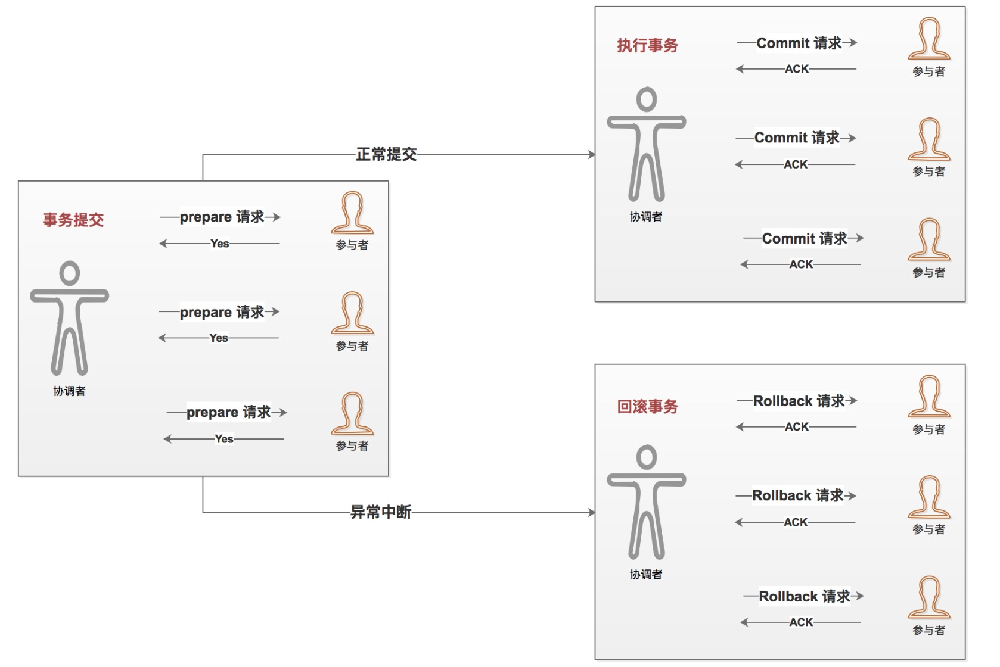
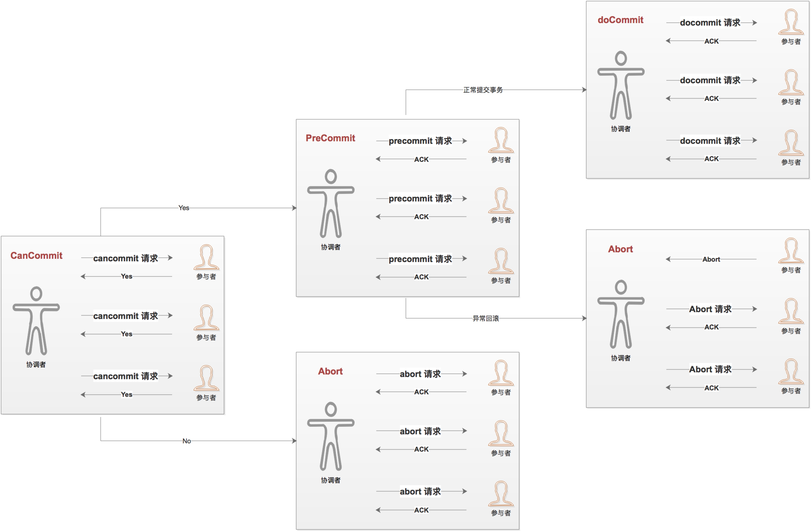

# 一致性协议
一致性协议从 **2PC** __3PC__ 分析  
分布式系统中，节点可用控制本身的事务，但是无法知道其他节点事务执行操作结果，当一个事务操作需要跨越
多个节点时，为了保持 **ACID** 需要引入一个称为 **协调者** 来统一调度所有分布式的执行逻辑，参与调
度的节点称为 **调度者** 。协调者负责调度参与者的行为，并最终决定这些参与者是否要把事务真正进行提交

## 二阶段提交 2PC

   二阶段提交分为
   - 提交事务请求
   - 执行事务请求
   
   ### 提交事务请求 - 投票阶段
   
   1. 事务询问  
     协调者向所有的参与者发生事务内容，询问是否可以执行事务提交操作，并开始等待所有参与者响应
   2. 执行事务  
     参与者执行事务操作，将 undo 和 redo 信息记入事务日志
   3. 各个参与者向协调者反馈事务询问的响应
     如果参与者执行事务操作，向协调者反馈 Yes，表示可以执行；如果参与者没有成功执行，向协调者
     反馈 No，表示事务不可以执行
      
   
   ### 执行事务提交
   
   - 执行事务提交  
   - 中断事务
   
   #### 执行事务提交
   所有参与者都想协调者反馈 Yes，执行事务提交  
   1. 协调者向所有参与者发送 commit 请求
   2. 参与者接收到 commit 请求，执行事务提交，释放资源
   3. 参与者完成事务提交，向协调者发送 ACK 
   4. 协调者接收到所有参与者 ACK，完成事务
   
   #### 中断事务
   一个参与者反馈 No 或者超时，协调者无法收到所有参与者反馈，中断事务 
   1. 协调者向所有参与者发送 rollback 请求
   2. 参与者接收到 rollback 请求，日志 undo 信息执行回滚操作，释放资源
   3. 所有参与者向协调者反馈回滚 ACK
   4. 协调者接收到所有参与者反馈，完成中断
    
   

   ### 2PC 优缺点
   优点：原理简单、实现方便  
   缺点： 
    - 同步阻塞：极大限制性能  
    - 单点问题：协调者单点问题  
    - 数据不一致：局部网络异常。协调者只发送部分 commit 请求，协调者故障。 
    - 保守：没有完善的容错机制
  
## 三段式提交 3PC
  3PC 是 2PC 的改进，将 2PC 的 "提交事务请求" 分为 "Can commit"、""pre commit"。
  
  - CanCommit
  1. 协调者向所有参与者发送 cancommit 请求，等待参与者响应
  2. 参与者接收到 cancommit 请求，向协调者发生 Yes，否则发送 No
  
  - PreCommit
  1. 如果所有参与者返回 Yes，执行事务预提交  
    (1). 协调者向所有参与者发送 PreCommit 请求，并进入 Prepared 阶段  
    (2). 参与者接收到 PreCommit 请求，执行事务，记录 redo 和 undo 信息  
    (3). 参与者反馈 ACK，等待协调者发送 doCommit 或者 abort  
  2. 如果任何一个参与者发送 No 或者等待超时，协调者将发送中断事务  
    (1). 协调者向所有参与者发送 Abort 请求    
    (2). 参与者接收到 Abort 请求或者等待协调者超时中断事务  
  
  - docommit
   1. 正常事务提交  
    (1). 协调者受到所有参与者 ACK，协调者从 "预提交" 变为 "提交" 状态，向所有参与者发送 doCommit 请求  
    (2). 参与者接收到 doCommit 请求，执行事务提交操作，释放资源。 
    (3). 参与者完成事务操作，向协调者发生 ACK 消息  
    (4). 协调者接收到所有参与者反馈的 ACK 消息，完成事务操作  
   2. 中断事务 
    协调者受到任意一个参与者反馈 No 或者等待超时，就会中断事务      
    (1). 协调者向所有参与者发送 Abort 请求  
    (2). 参与者接收到协调者发生的 Abort 请求或者等待超时，执行 Undo 信息回滚事务，释放资源  
    (3). 参与者回滚事务，发送 ACK 信息  
    (4). 协调者受到参与者中断事务 ACK，中断事务  
   协调者故障或者参与者与协调的网络故障，参与者都会在等待超时后进行事务提交
   
   
   
   ### 优缺点
   优点：相对于 2PC 降低参与者阻塞范围，并且能够在出现单点故障继续达成一致 
   缺点：参与者接收到 PreCommit 后，如果出现网络分区，此时协调者所在节点与参与者无法正常通信，该参与者依然会提交事务，
   造成数据不一致。
   
   
   
   
   
   
   
   
   
   
   
   
   
   
   
   
   
   
   
   
   
   
   
   
   
   
   
   
   
