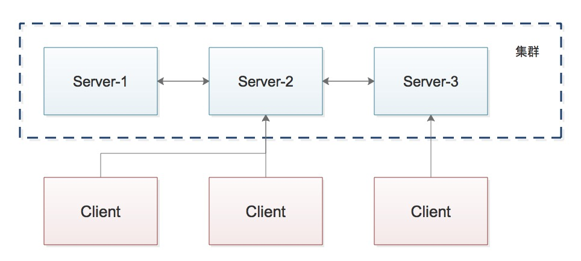

# ZooKeeper
[官网地址](https://zookeeper.apache.org/)  
[并发编程-翻译](http://ifeve.com/apache-zookeeper-1/)

# 关键字
> ZooKeeper 分布式 分布式协调框架 集中式服务 管理配置信息 命名服务 分布式同步 分组服务 分布式应用

# 分布式应用
  分散数据处理能力：分布式应用通过使用所有系统涉及的计算能力可以在几分钟内完成。
  一组相同分布式应用组成服务称为集群，而在集群中运行的每个服务实例被称为节点。
  分布式应用分为：Server 和 Client 。Server 是分布式的，提供通用的接口，客户端可以连接到集群中的任何服务器并获得相同的结果。
  

# 分布式优点

- 高可用
- 可扩展性 支持快速动态扩展服务实例
- 透明性 隐藏服务复杂性

# 分布式挑战

  竞争条件 死锁 不一致

# ZooKeeper 常见服务

+ 命名服务 - 按名称标识集群中的节点。它类似于DNS，但仅对于节点
+ 配置管理 - 应用服务系统配置信息
+ 集群管理 - 实时地在集群和节点状态中加入/离开节点
+ 服务协调 - 选举一个节点作为协调目的的leader
+ 锁定和同步服务 - 修改数据的同时锁定数据
+ 高度可靠的数据注册表 - 在一个或几个节点关闭时也可以获得数据

