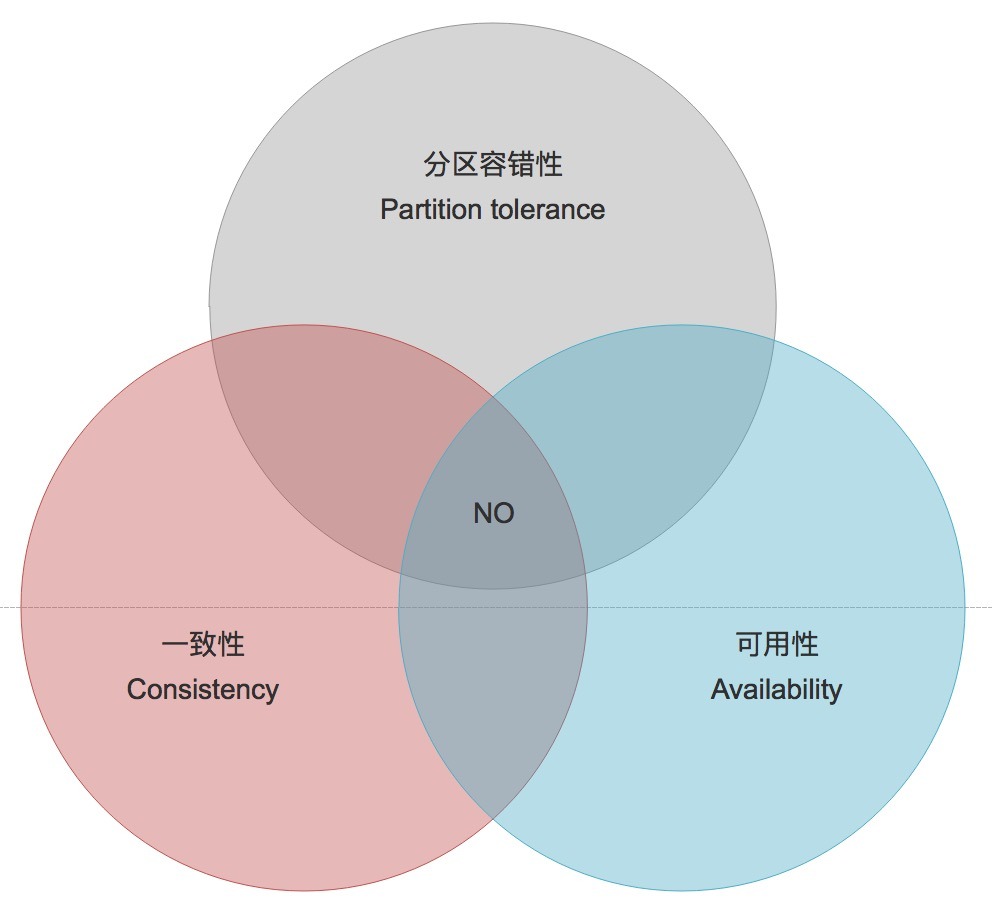

# 分布式理论知识

## 分布式 与 集中式 对比

  **集中式**：数据集中存储中心节点，业务部署在中心节点；开发、部署、监控简单
  
  **分布式**：组件分布在不同网络机器上，依靠  __消息__  进行通信和协调
      
  &ensp;&ensp;&ensp;  __分布性__  
  &ensp;&ensp;&ensp;  __对等性__ : 组成分布式系统的所有计算机节点都是
  对等的。节点可以理解为分布式副本一种冗余方式，副本包含数据副本和应用服务副本。 
  &ensp;&ensp;&ensp;  __并发性__ : 多个节点共享资源，存在资源竞争问题，
  这也是分布式一个重要课题。 
  &ensp;&ensp;&ensp;  __全局时钟__ : 分布式系统缺乏全局时钟。一个典型
  的分布式系统由一系列 __空间任意__ 分布进程组成，进程之间执行业务时间和事件无法控制。 
  &ensp;&ensp;&ensp;  __故障不可避免__ : 墨菲定理，故障总会发生。
  
## 分布式环境问题

   **通信异常**: 网络不可靠(网络抖动、网络延迟)、服务处理能力等造成消息丢失或消息延迟
   
   **网络分区(脑裂)**: 部分节点之间正常通信。分布式系统出现局部小集群，小集群间会独立完成原本需要整个分布式
   系统才能完成的功能 
   
   **三态**: 分布式响应结果，成功、失败、超时。超时的可能原因：请求丢失、响应丢失
   
   **节点故障**: 
   
## ACID 到 CAP/BASE
  事务属性：原子性(Atomicity)、一致性(Consistency)、隔离性(Isolation)、持久性(Durability) 
  隔离性：读未提交、读已提交、可重复读、串行化
  
  分布式事务：事务参与者、支持事务的服务器、资源服务器以及事务管理器分别位于分布式系统的不同节点上。
  
  ### CAP
   - C: Consistency(一致性)
   - A: Availability(可用性)
   - P: Partition tolerance(分区容忍)
   
   分布式系统不可能同时满足 C/A/P, 最多只能同时满足其中两项
   
   一致性：数据在多个副本之间是否能保持一致性的特性。
   可用性：系统服务必须一直处于可用状态，对于用户的每一个操作请求总是能够在有限的时间内返回结果。"有限时间内"：
   对于用户的一个操作请求，系统必须能够在指定时间返回响应处理结果，如果超出了这个时间，那么系统就被认为是不可
   用的。"返回结果"：要求系统在完成对用户请求的处理后，返回一个正常的响应结果。
   分区容错性：分布式系统在遇到任何网络分区故障的时候，仍然需要能够保证对提供满足一致性和可用性服务，除非是整个
   网络环境都发生了故障。
   
   
   #### CAP 应用  
       分布式系统分区容忍是最基本要求  
      
   > 放弃 P: 简单做法将数据放在一个节点上，无法 100% 保证系统可用。放弃 P 意味放弃可扩展性
   
   > 放弃 A: 相对放弃 P, 放弃 A 正好相反，一旦系统遇到网络分区或其他故障，那么收到影响的服务需要等待一段时间
   才能恢复，这一段时间服务不可用
   
   > 放弃 C：放弃数据一致性，系统价值降低甚至没有价值。一般来说，放弃一致性指放弃强一致性，保留最终一直性
   
  ### BASE
   BASE 是对 CAP 中一致性和可用性权衡的结果，是基于 CAP 定理演化处理，其核心是无法做到强一直性，采用适当方式来
   达到最终一致性(Eventually consistency)
  
   - 基本可用: Basically Availible
   - 软状态: Soft sate 
   - 最终一致性: Eventually consistent 
   
   > 基本可用：分布式系统出现不可预知故障的时候，允许损失部分可用性。包括：时间上的损失、功能上的损失
   
   > 弱状态：允许系统在不同节点的数据副本之间进行数据同步过程存在延时
   
   > 最终一致性：系统中所有数据服务，经过一段时间的同步后，最终达到一个一致的状态。数据达到一致状态的时间延时取决于
   网络延迟、系统负载和数据复制方案设计等  
       - 因果一致性  
       - 读已写  
       - 回话一致性  
       - 单调读一致性  
       - 单调写一致性  
   >
   
   BASE 理论面向的是大型高可用可扩展的分布式系统，通过牺牲强一致性来获得可用性，并允许数据在一段时间内是不一致的，
   最终达到一致状态。
   
## ZooKeeper 与 CAP
  **可用性** 
      
   - 不能保证每次服务请求的可用性  
   
    任何时刻对ZooKeeper的访问请求能得到一致的数据结果，同时系统对网络分割具备容错性；
    但是它不能保证每次服务请求的可用性（注：也就是在极端环境下，ZooKeeper可能会丢弃一些请求，
    消费者程序需要重新请求才能获得结果）。所以说，ZooKeeper不能保证服务可用性。
    
   - 进行leader选举时集群都是不可用  
   
    在使用ZooKeeper获取服务列表时，当master节点因为网络故障与其他节点失去联系时，剩余节点会
    重新进行leader选举。问题在于，选举leader的时间太长，30 ~ 120s, 且选举期间整个zk集群都
    是不可用的，这就导致在选举期间注册服务瘫痪，虽然服务能够最终恢复，但是漫长的选举时间导致的
    注册长期不可用是不能容忍的。所以说，ZooKeeper不能保证服务可用性。   
       
   
     
   
   
   
   
   
   
   
   